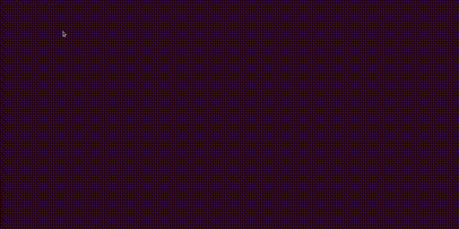

# Screencapture
A minimal screen capture and annotation tool for X11 windowing systems



### Key Features:
- Simple annotation and undo capabilities.
- Each time region gets selected it gets copied to X11 clipboard.
- Supports large selections with INCR protocol.
- No external system dependencies - communication based exclusively [xgb bindings](https://github.com/BurntSushi/xgb).

### Shortcuts overview:
For better ergonomics assign the executable to a shortcut ie.: (Super+Shift+S)
- **Left mouse button (LMB)**: drawing
- **Shift + LMB**: Selecting region to export.
  - This copies the files to clipboard and also saves a copy to /tmp.
  - Each selection updates content of the clipboard and creates a new png file in /tmp
- **Esc**: Exits program
- **][**: Decrease / Increase brush size
- **Ctrl+Z**: Undo

### Build

```
go get
go build screencapture.go
```
